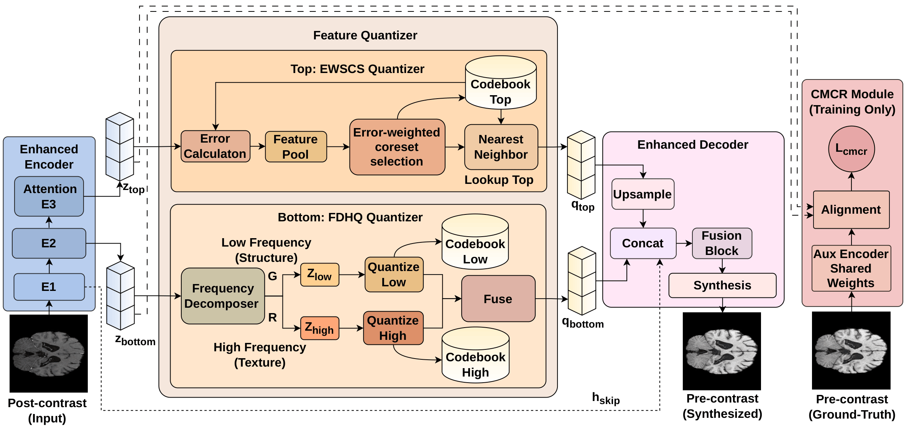

# Bridging the Contrast Gap: Frequency-Aware Discrete Representation Learning for Cross-Modal MRI Synthesis


Official implementation of the paper **"Bridging the Contrast Gap: Frequency-Aware Discrete Representation Learning for Cross-Modal MRI Synthesis"**.



## Overview

This repository contains the source code for the **Enhanced CS-VQ-VAE** framework, designed for high-fidelity cross-modal MRI synthesis (T1 post-contrast → T1 pre-contrast). Our framework addresses the common issues of codebook collapse and modality-specific contrast bias by introducing three novel components:

1.  **Error-Weighted Semantic Coreset Selection (EWSCS)**: Prioritizes challenging anatomical regions by integrating reconstruction error into the codebook re-initialization process.
2.  **Cross-Modal Consistency Regularization (CMCR)**: Enforces anatomical alignment between source and target modalities through latent feature and distribution regularization.
3.  **Frequency-Decomposed Hierarchical Quantization (FDHQ)**: Separates structural (low-frequency) and textural (high-frequency) information into distinct discrete spaces.


*Our method achieves a **46% improvement in FID** over the best competing discrete baseline while using **130× fewer FLOPs** than diffusion models.*

---

## Project Structure

```bash
enhanced-cs-vqvae/
├── models/
│   ├── ewscs_quantizer.py     # Error-weighted semantic coreset selection
│   ├── fdhq_quantizer.py      # Frequency-decomposed hierarchical quantization
│   ├── cmcr_module.py         # Cross-modal consistency regularization
│   ├── discriminator.py       # PatchGAN discriminator
│   └── enhanced_vqvae2.py     # Main model architecture
├── losses/
│   └── losses.py              # Perceptual, Frequency (FFT), and Gradient losses
├── config.yaml                # Main configuration file
├── train.py                   # Training entry point
└── evaluate.py                # Evaluation and inference script
```

## Installation

### Prerequisites
- Python 3.8+
- PyTorch 1.12+ (CUDA enabled)

### Setup
```bash
git clone https://github.com/otakuresearcher/CrossModal-MRI-Synthesis.git
cd CrossModal-MRI-Synthesis
```

*Required packages: `torch`, `torchvision`, `einops`, `lpips`, `scikit-learn`, `PyYAML`, `matplotlib`, `tqdm`.*

---

## Usage

### 1. Data Preparation
The model expects paired T1 post-contrast and T1 pre-contrast 2D slices. Organize your dataset as follows:
```bash
data/
├── train/
│   ├── postcontrast/
│   └── precontrast/
├── val/
└── test/
```

### 2. Training
Configure `config.yaml` with your data paths and hyperparameters. Then run:
```bash
python train.py --config config.yaml --exp "enhanced_v1" --device 0
```

### 3. Evaluation
To generate synthetic images and compute metrics (LPIPS, FID, PSNR, SSIM):
```bash
python evaluate.py --config config.yaml --checkpoint path/to/best_model.pth --device 0
```

---

## Implementation Details

- **Optimizer**: Adam ($\beta_1=0.5, \beta_2=0.999$, lr=$4.9 \times 10^{-4}$)
- **Architecture**: 3-level hierarchical encoder with self-attention at the bottleneck.
- **Quantization**: Codebook size 512, Latent dimension 64.
- **Loss Weights**: $\lambda_{\text{pix}}=1.12$, $\lambda_{\text{perc}}=0.61$, $\lambda_{\text{freq}}=0.1$, $\lambda_{\text{grad}}=0.1$.
- **CMCR**: Weight $\gamma=1.38$ (fine-tuned).
- **EWSCS**: Weight $\lambda=0.74$ (fine-tuned).

---


